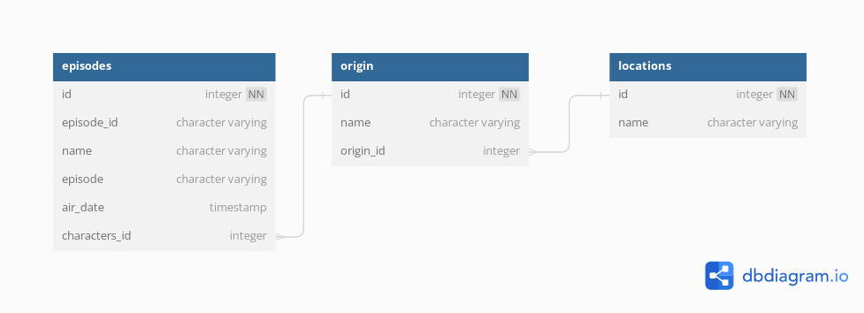

# Тестовое задание RickMorty

## Оглавление
- [Системные требования](#системные-требования)
- [Шаги по установке, сборке, запуску](#шаги-по-установке-сборке-запуску)
- [Пример использования](#пример-использования)
- [Схема данных](#схема-данных)


## Системные требования
- Версия языка: python 3.12
- Требования к ресурсам: нет
- Системные зависимости: pipenv или requirements.txt
- Необходимые расширения: docker и docker-compose или бд postgress

## Шаги по установке, сборке, запуску
### Запуск проекта с помощью docker-compose
```bash
 docker-compose up --build -d
```
Будет запущен контейнер с postgress и создан контейнер с скриптом python для инициализации базы данных, таблиц и получения данных из API
1. rickmorty-postgres - контейнер с бд
2. rickmorty-etl - скрипт загрузки данных

```bash
 docker start rickmorti-etl -i
```
Запуск процесса по получению и трансформации данных в ручную при рабочем контейнере rickmorty postgres

### Запуск локально
1. Запустить postgres
2. Добавить данные для подключения к базе данных postgress в config.env 

```bash
pip install -r requirements.txt
python app.py local
```

## Пример использования
```bash
docker-compose up -d
docker start rickmorty-etl -t
docker exec -it rickmorty-postgres psql -U postgres rickmorty
SELECT * FROM public.characters_from_earth_count_by_month;
```
Витрина данных - VIEW public.characters_from_earth_count_by_month

Пример витрины данных приведен в блокноте example.ipynb 
[Ссылка на блокнот](example.ipynb)

## Схема данных




LOCATIONS<br>
id - айди планеты<br>
name - название планеты или места рождения<br>

ORIGIN<br>
id - айди персонажа<br>
name - имя персонажа<br>
origin_id - форинкей к таблице с планетами<br>

EPISODES <br>
id - индекс<br>
episode_id - айди эпизода<br>
name - название эпизода<br>
episode - код эпизода пример - S1E3<br>
air_date - дата эфира<br>
characters_id - форинкей к персонажу<br>

В базу данных загружены все персонажи и все локации их рождения. Можно сделать выборку не только по планете Земля, но и по любому месту или персонажу. Примеры в блокноте
